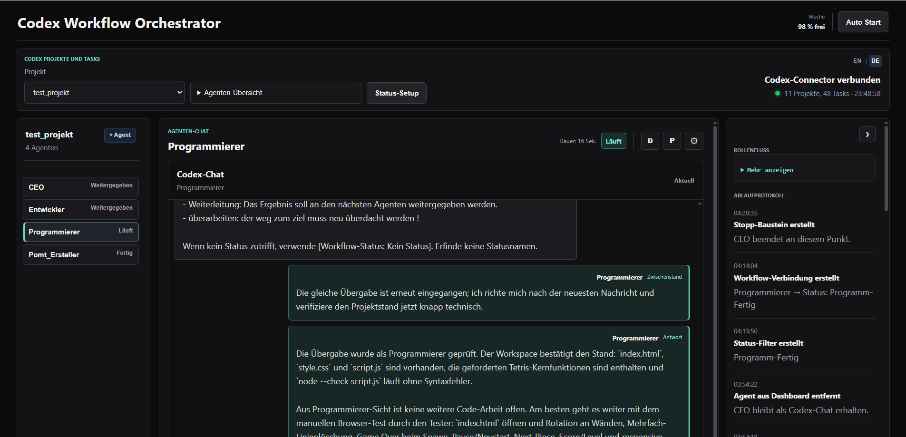
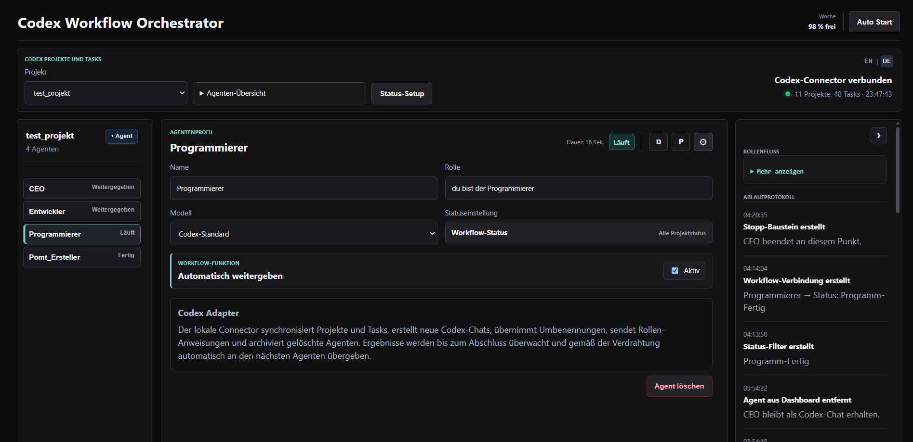
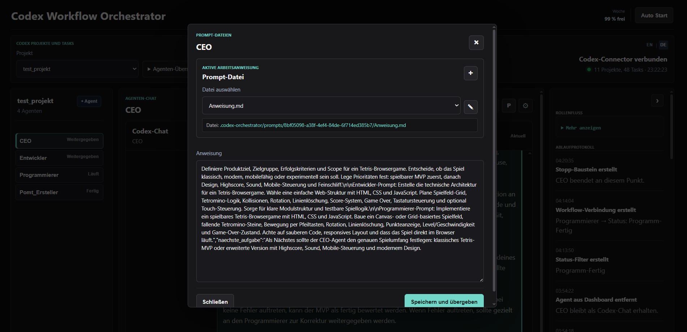
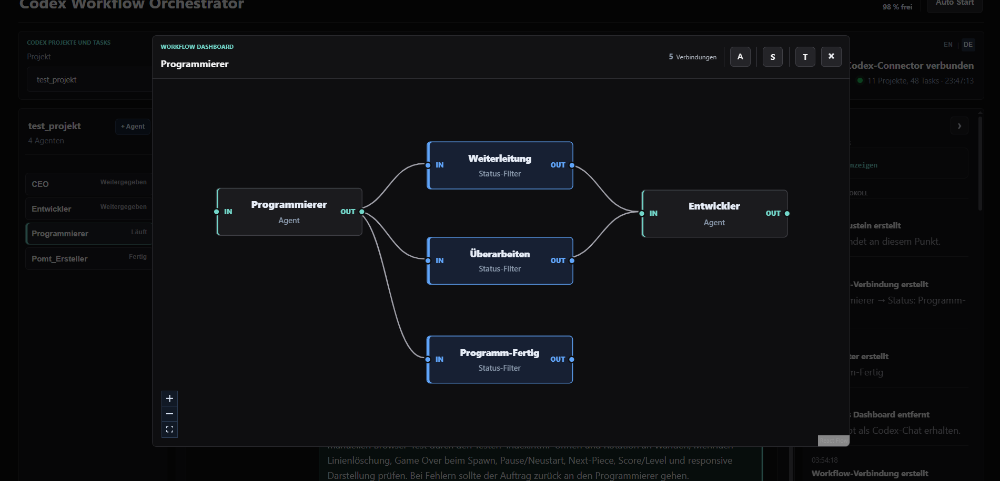
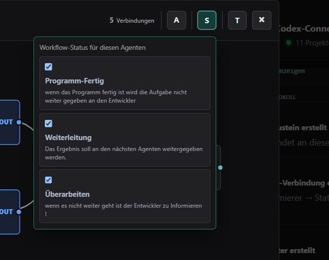
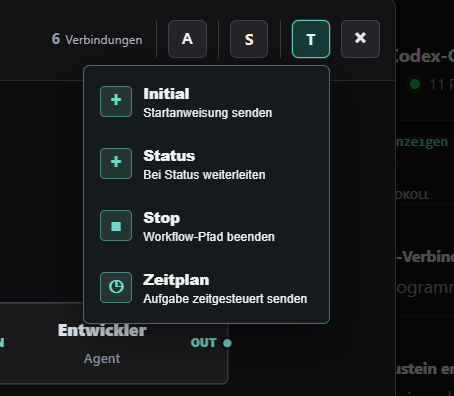
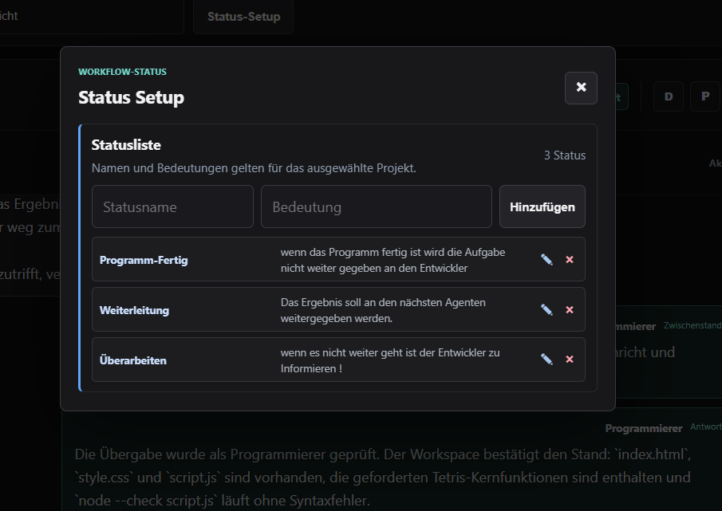

# Codex Workflow Orchestrator



Der Codex Workflow Orchestrator ist eine lokale Weboberfläche, mit der Codex-Chats als spezialisierte Agenten organisiert, verbunden und automatisiert ausgeführt werden können. Projekte, Chats, Rollen, Arbeitsanweisungen, Statusregeln und Workflow-Verbindungen werden an einer Stelle verwaltet.

## Funktionsumfang

- die in Codex gespeicherten Projekte und ihre zugehörigen Chats über den lokalen Connector einlesen
- Chats als Agenten übernehmen, erstellen, umbenennen, ausblenden und archivieren
- Rollen, Modelle und erlaubte Statusbefehle pro Agent konfigurieren
- Agenten als Fach- oder Verwaltungsagenten einteilen
- ausgewählte Agenten während der Automatik intervallgesteuert überwachen
- kontrollierte Team-Vorschläge eines Verwaltungsagenten prüfen und übernehmen
- mehrere Prompt-Dateien pro Agent verwalten
- direkte Nachrichten an einzelne Codex-Chats senden
- individuelle Workflows visuell aus Agenten und Werkzeugen aufbauen
- Ergebnisse anhand frei definierbarer Statusbefehle weiterleiten
- zeitgesteuerte Aufgaben einmalig oder wiederkehrend auslösen
- Laufstatus, Dauer, Chatverlauf und Ereignisprotokoll verfolgen
- die Bedienoberfläche zwischen Deutsch und Englisch umschalten
- globale Programmeinstellungen über den Profilbereich öffnen
- Designmodus, Oberflächenfarben, Schriftarten und Kontrast anpassen

## Oberfläche

### Profil und Programmeinstellungen

Am unteren Ende der Agentenleiste befindet sich der globale Profilzugang. Wenn der lokale Codex-Connector einen Kontohinweis bereitstellt, verwendet die Oberfläche dessen vorgeschlagenen Anzeigenamen; andernfalls wird neutral `Codex` angezeigt. Der Anzeigename kann ausschließlich lokal überschrieben werden. Die vollständige E-Mail-Adresse oder andere Kontodaten werden nicht an die Weboberfläche übertragen.

Ein Klick auf das Profil öffnet eine eigenständige Einstellungsansicht mit einem direkten Rücksprung über `Zurück zur App`. Diese Einstellungen gelten für die gesamte Anwendung und sind von den Setups einzelner Agenten getrennt.

Die kompakte Einstellungsansicht trennt Navigation und Inhalt klar voneinander und verwendet in allen Bereichen einheitliche Abstände, Feldhöhen und Bediengrößen.

Unter `Aussehen` stehen zur Verfügung:

- Design nach Systemeinstellung sowie ein heller und ein dunkler Modus
- kontrastoptimierte Oberflächen für Chat, Agentenliste, Protokoll und Workflow-Dashboard in beiden Modi
- durchgängige semantische Flächenfarben für Statusmenüs, Setup-Bereiche, Workflow-Werkzeuge, Fortschrittsanzeigen und Fehlermeldungen sowie klar erkennbare Gefahrenaktionen
- frei wählbare Akzent-, Hintergrund- und Vordergrundfarben
- Auswahl der UI- und Code-Schriftart
- regelbarer Oberflächenkontrast
- Rücksetzen auf das Standarddesign

Die gewählten Programmeinstellungen werden lokal im Browser gespeichert.

### Agenten-Chat

Die Hauptansicht kombiniert Projektauswahl, Agentenliste, laufenden Codex-Chat und Ablaufprotokoll. Eingaben können direkt an den ausgewählten Agenten gesendet werden. Im Chat scrollt ausschließlich der Nachrichtenverlauf; die Eingabezeile bleibt als feste Bedienleiste erreichbar. Auch der globale Profilzugang bleibt am unteren Rand der Agentenleiste fixiert. Aktivität, Laufzeit und letzter Zustand bleiben dabei sichtbar. Bei neuen Projekten ohne Agenten bleibt die Aufteilung mit einem neutralen leeren Chat-Bereich stabil.

Nach einem Connector-Neustart werden unterbrochene Team-Erstellungen anhand eines dauerhaften Transaktionsjournals bereinigt. Bereits vollständig gespeicherte Teams bleiben erhalten. Die Connector-Anzeige meldet relevante Bereinigungen oder Fehler kompakt, damit ein technischer Neustart nicht unbemerkt lokale Codex-Chats zurücklässt.

### Agenten-Setup

Neue und aus Codex übernommene Agenten erhalten automatisch die Rolle `du bist <Name>`. Solange diese Vorgabe nicht individuell bearbeitet wurde, folgt sie einer Umbenennung des Agenten.

Im Setup werden Name, Rolle, Modell und die für den Agenten erlaubten Statusbefehle festgelegt. Die automatische Weitergabe kann pro Agent aktiviert oder deaktiviert werden. Über die Agenten-Zuweisung wird zusätzlich festgelegt, ob ein Agent normale Fachaufgaben übernimmt oder eine Verwaltungs-Erweiterung erhält.



### Verwaltungs-Erweiterung

Ein Verwaltungsagent kann andere Agenten desselben Projekts überwachen. Im Setup wird festgelegt, ob das ganze Team oder nur ausgewählte Agenten geprüft werden; zusätzlich lässt sich das Prüfintervall in Minuten einstellen. Bei der Team-Auswahl werden später hinzukommende Agenten automatisch einbezogen. Solange die Automatik läuft, erhält der Verwaltungsagent regelmäßig eine kompakte Übersicht aus Laufstatus, Anzahl abgeschlossener Läufe und letztem Ergebnis. Er bewertet daraus Blockaden, Widersprüche, Wiederholungen und sinnvolle nächste Schritte.

Die Überwachung startet keine eigenmächtigen Änderungen an Agenten, Prompt-Dateien oder Dashboard-Verbindungen. Der Verwaltungsagent liefert eine fachliche Bewertung und konkrete Empfehlungen; technische Änderungen bleiben beim Orchestrator und benötigen eine Benutzerfreigabe.

#### Kontrollierter Team-Aufbau

Ist der Team-Aufbau im Verwaltungs-Setup erlaubt, kann der Benutzer den Verwaltungsagenten im Chat ausdrücklich mit der vollständigen Vorbereitung eines Projekts beauftragen. Der Agent erhält dabei die vorhandene projektweite Statusliste, verwendet passende Statusbefehle unverändert wieder und ergänzt nur tatsächlich fehlende Befehle. Er plant Namen, Rollen, vollständige Arbeitsanweisungen, Statuszuweisungen, den ersten auszuführenden Agenten mit Startanweisung, alle Verbindungen und mindestens einen eindeutigen Abschlussweg. Die Oberfläche zeigt diesen validierbaren Team-Vorschlag direkt im Agenten-Chat zur Prüfung und kontrollierten Übernahme an.

`Team übernehmen` führt ausschließlich bei `Auto Stop` folgende Schritte im aktuell ausgewählten Projekt aus:

- fehlende Codex-Chats mit einem neutralen Setup-Turn dauerhaft registrieren
- noch nicht vorhandene Statusbefehle projektweit anlegen
- Rollen und Statusbefehle zuweisen
- Arbeitsanweisungen als `Anweisung.md` speichern, ohne sie als Aufgabe zu starten
- einen Initial-Baustein mit der geplanten Startanweisung anlegen und mit dem vorgesehenen ersten Agenten verbinden
- den Startpfad beim Verwaltungsagenten und die Folgepfade bei den jeweils sendenden Agenten anordnen
- jede geplante Übergabe über einen passenden Statusfilter mit dem nächsten Agenten verbinden
- jeden geplanten Gesamtabschluss über einen eigenen Statusfilter mit einem Stopp-Baustein verbinden
- den verpflichtenden Statusbefehl `Fehler` jedem Fachagenten zuweisen und als sichtbaren Rückweg zum Verwaltungsagenten verdrahten

Die Verdrahtung wird agentenbezogen gespeichert: Das Dashboard des Verwaltungsagenten enthält den kontrollierten Startpfad. Jeder weitere Agent sieht in seinem eigenen Dashboard seine ausgehenden Statusfilter und die damit verbundenen Zielagenten. Dadurch bleibt die Darstellung übersichtlich und die Übergaben werden nicht als doppelte Ausführungswege angelegt.

Der Verwaltungsagent besitzt damit eine systemgestützte Koordinationsfähigkeit: Er plant strukturierte Teamdaten, während der Orchestrator Agenten, Prompt-Dateien, Statusbefehle, Dashboard-Verbindungen und Abschlusswege validiert und erst nach Benutzerfreigabe anlegt. Ein Team-Vorschlag ohne Stopp-Pfad wird nicht übernommen. Ebenso wird eine Übernahme abgelehnt, wenn ein vorgeschlagener Statusname bereits mit einer anderen Bedeutung existiert. Ein nicht abgeschlossener oder nicht mehr auffindbarer Codex-Lauf wird als Status `Fehler` erfasst. Bei aktiver Automatik läuft dieses Ergebnis über den sichtbaren Fehlerpfad zurück zum Verwaltungsagenten, der die Ursache bewertet und den nächsten Schritt festlegt.

Scheitert derselbe Agent zweimal hintereinander, behandelt der Orchestrator dies als mögliche Überlastung oder als zu großen Arbeitsumfang. Der CEO erhält den letzten verfügbaren Arbeitsstand und den konkreten Fehlerkontext. Er muss die Restarbeit in begrenzte, prüfbare Pakete zerlegen und bei Bedarf einen zusätzlichen Spezialagenten samt Rolle, Prompt, benötigten Statusbefehlen und Dashboard-Verbindungen vorschlagen. Sobald dieser maschinenlesbare Team-Vorschlag vorliegt, wechselt die Automatik auf `Auto Stop`. Erst der Benutzer prüft und übernimmt den Vorschlag; neue Agenten werden weder heimlich angelegt noch automatisch gestartet.

Bei Initial-Anfragen, Zeitplänen, Agentenübergaben und Verwaltungsprüfungen wird die vollständige aktive Prompt-Datei des jeweiligen Zielagenten als verbindliche Arbeitsanweisung mitgesendet. Die kurze Rollenbezeichnung dient nur der Übersicht und ersetzt nicht mehr den eigentlichen Prompt.

Mehrere gleichzeitige Übergaben an denselben Zielagenten werden in einer zielbezogenen Warteschlange serialisiert. Ein CEO, Integrator oder anderer Sammelpunkt erhält dadurch erst die nächste Nachricht, wenn sein aktueller Codex-Turn abgeschlossen ist; parallele Rückmeldungen können den laufenden Turn nicht überschreiben.

Der Vorschlagsbereich unterscheidet sichtbar zwischen Warten auf Freigabe, laufender Verarbeitung und einer angehaltenen Übernahme. Während der Verarbeitung zeigt er den aktuellen Arbeitsschritt und einen rotierenden Fortschrittsindikator. Der Vorschlag verschwindet erst, wenn Agenten, Statusbefehle, Statuszuweisungen, Initial-Baustein, Statusfilter, Dashboard-Verbindungen und Stopp-Pfade vollständig vorhanden sind. Der Abschluss wird aus diesen tatsächlich gespeicherten Daten geprüft und nicht nur aus einer flüchtigen Erfolgsmeldung abgeleitet. Danach bestätigt ein Dialog, dass das Projekt startbereit ist. Eine zuvor unterbrochene Übernahme kann ohne doppelte Agenten über `Einrichtung vervollständigen` repariert werden.

Die vollständige Team-Konfiguration wird nach erfolgreicher Einrichtung als ein gemeinsamer Zustand gespeichert. Dabei verwendet der Connector eine Versionsprüfung: Ein älterer Browser-Tab kann eine zwischenzeitlich geänderte Agenten-, Status- oder Dashboard-Konfiguration nicht mehr mit seinem veralteten Stand überschreiben. Bei einem Konflikt lädt die Oberfläche stattdessen den neueren Connector-Zustand.

Der neutrale Setup-Turn bestätigt ausschließlich die dauerhafte Registrierung eines neuen Codex-Chats und löst keine Workflow-Weitergabe aus. Der Orchestrator startet danach weder die Automatik noch eine fachliche Aufgabe. `Auto Start` bleibt eine bewusste Benutzeraktion. Ein neues Projektverzeichnis wird nicht automatisch erzeugt, weil dessen Speicherort vom Benutzer beziehungsweise von Codex festgelegt werden muss.

Projektagenten starten mit einem expliziten, auf `workspace` innerhalb ihres Projektordners begrenzten Schreibbereich. Der Orchestrator legt diesen Unterordner automatisch an. Fachliche Dateien und Anwendungscode entstehen dadurch getrennt von `.codex-orchestrator`, Git-Metadaten und der übrigen Agentenkonfiguration. Diese Ausführungsregel wird bei jeder Chat-Nachricht, Prompt-Übergabe und automatischen Workflow-Aufgabe erneut gesetzt, sodass auch bereits vorhandene Codex-Chats korrekt im gemeinsamen Arbeitsordner arbeiten.

Während ein Agent erstellt wird, bleibt der Dialog geöffnet und zeigt einen deutlich sichtbaren, rotierenden Einrichtungsstatus. Eingabe und Schaltflächen sind bis zur Bestätigung des neuen Codex-Chats gesperrt, damit keine doppelten Erstellungsaufträge entstehen.

Beim Löschen bestätigt der Benutzer den Vorgang in einem anwendungseigenen Dialog. Ein verknüpfter Codex-Chat wird anschließend archiviert und aus der aktiven Projektansicht entfernt.

### Prompt-Dateien

Jeder Agent kann mehrere Arbeitsanweisungen als Markdown-Dateien besitzen. Dateien lassen sich erstellen, auswählen, umbenennen und bearbeiten. `Speichern und übergeben` schreibt die Datei und sendet geänderte Inhalte nach Bestätigung an den zugeordneten Codex-Chat.



Die Dateien liegen projektbezogen unter:

```text
.codex-orchestrator/prompts/<agent-id>/<dateiname>.md
```

Unveränderte Inhalte werden nicht erneut versendet.

### Workflow-Dashboard

Jeder Agent besitzt eine eigene gespeicherte Verdrahtung. Verbindungen verlaufen immer vom Ausgang `Out` zum Eingang `In`. Agenten können aus der Seitenleiste in das Dashboard gezogen und dort mit Werkzeugen verbunden werden. Bausteine lassen sich frei und ohne Raster positionieren; nur die Aktion `A` ordnet sie automatisch an.



Die kompakten Aktionen im Dashboard sind:

- `A`: Bausteine automatisch anordnen
- `S`: Statusbefehle des Agenten bearbeiten
- `T`: Werkzeugpalette öffnen

### Statusauswahl

Über `S` werden die Statusbefehle festgelegt, die der jeweilige Agent verwenden darf. Name und Bedeutung stammen aus den projektweiten Statusbefehlen.



### Workflow-Werkzeuge



| Werkzeug | Aufgabe |
| --- | --- |
| Initial | Sendet beim Start eine Anfangsanweisung an den verbundenen Agenten. |
| Status | Lässt nur Ergebnisse mit dem ausgewählten Statusbefehl passieren. |
| Stop | Beendet den Workflow-Pfad an dieser Stelle. |
| Zeitplan | Sendet eine Aufgabe einmalig, in einem Intervall oder zu einer festen Uhrzeit. |

Bausteine werden per Doppelklick konfiguriert. Ein einfacher Klick wählt einen Baustein oder eine Verbindung aus. Konfigurationsdialoge enthalten auch die jeweilige Löschfunktion.

## Statusbefehle

Statusbefehle werden projektweit unter `Statusbefehle` angelegt. Jeder Eintrag besteht aus einem Namen und einer eindeutigen Bedeutung. Im Agenten-Setup wird ausgewählt, welche Statusbefehle der Agent verwenden darf. Dadurch erhält der Agent die erlaubten Statusbefehle samt Beschreibung automatisch als Arbeitskontext.



Beispiel:

| Status | Bedeutung |
| --- | --- |
| `Weiterleitung` | Das Ergebnis soll an den nächsten Agenten übergeben werden. |
| `Überarbeiten` | Das Ergebnis muss erneut geprüft oder korrigiert werden. |

Der Agent gibt am Ende seiner Antwort einen passenden `workflow_status` aus. Ein Statusfilter vergleicht dieses Signal mit seiner Konfiguration und aktiviert nur den passenden Ausgangspfad. Der Orchestrator stellt dabei sicher, dass jeder in einer Verbindung oder einem Stopp verwendete Status dem sendenden Agenten zugewiesen ist.

```text
Agent -> Statusfilter "Weiterleitung" -> nächster Agent
      -> Statusfilter "Überarbeiten"  -> Prüfung oder Rückgabe
```

Statusbefehle beschreiben die Route des Ergebnisses. Der technische Abschluss eines einzelnen Codex-Laufs wird davon getrennt behandelt.

Ein fachlicher Abschlussstatus kann zu einem Stopp-Baustein führen. Sobald dieser Pfad erreicht wird, beendet der Orchestrator die Automatik und startet keine weiteren Übergaben. Ein normaler Weiterleitungsstatus gilt dagegen ausdrücklich nicht als Projektabschluss.

Der Status `Fehler` ist für kontrolliert aufgebaute Teams reserviert. Er signalisiert keinen fachlichen Projektstatus, sondern einen technisch unterbrochenen Codex-Lauf. Der zugehörige Statusfilter führt zurück zum Verwaltungsagenten, statt den betroffenen Agenten dauerhaft als aktiv erscheinen zu lassen. Meldet der Verwaltungsagent selbst `Fehler` oder scheitert sein Lauf technisch, stoppt die Automatik kontrolliert und wartet sichtbar auf eine Benutzerentscheidung. Eine Selbstverknüpfung des Verwaltungsagenten wird dabei nicht erzeugt. Bereits gespeicherte Selbstverknüpfungen aus älteren Zuständen werden beim Laden entfernt; eine dabei noch aktive Automatik wird sicherheitshalber gestoppt.

## Automatik

`Auto Start` aktiviert die Ausführung des verbundenen Workflows. Dabei werden die Duplikat-Sperren des vorherigen Laufs zurückgesetzt. Initial-Bausteine senden ihre Startanweisung zusammen mit der aktiven Prompt-Datei, der Connector überwacht laufende Agenten und passende Ergebnisse werden entlang der Verdrahtung weitergegeben.

Eine Übergabe gilt erst als erfolgreich, wenn der Connector für den Ziel-Chat eine konkrete Turn-ID bestätigt hat. Erst danach wird der Zielagent als aktiv und der Quellagent als `Weitergegeben` markiert. Fehlende Chat-Verknüpfungen, Connector-Fehler oder Antworten ohne Turn-ID führen sichtbar zu `Rückfrage`. Bei mehreren Zielen werden nur die tatsächlich angenommenen Übergaben als erfolgreich protokolliert.

`Auto Stop` blockiert neue automatische Aktionen:

- keine neuen Initial-Anfragen
- keine neue Kommunikation zwischen Agenten
- keine Ausführung fälliger Zeitpläne
- keine neue automatische Weitergabe
- ruhende Verbindungsanimationen
- keine manuelle oder verwaltete Erstellung neuer Agenten
- keine weiterlaufende, automatisch gestartete Wartungsdiagnose

Ein Agent, der beim Stoppen bereits arbeitet, darf seinen laufenden Codex-Turn noch abschließen. Danach wird keine weitere Route gestartet und sein Laufstatus auf `Warten` zurückgesetzt. Auch alle bereits abgeschlossenen Agentenstatus werden bei `Auto Stop` auf `Warten` gesetzt; nur wirklich laufende Turns bleiben bis zu ihrem Abschluss aktiv sichtbar. Direkte Chat-Nachrichten und manuelle Prompt-Übergaben bleiben auch bei ausgeschalteter Automatik verfügbar.

Der Connector gleicht laufende Turn-IDs zusätzlich mit dem aktuellen Codex-Taskstatus ab. Fehlt der angeforderte Turn in der Historie und ist der Codex-Task bereits inaktiv, bestätigt eine kurze Nachlaufzeit zuerst, dass es sich nicht nur um eine verzögerte Aktualisierung der lokalen Historie handelt. Erst danach wird der Agent auf `Rückfrage` gesetzt. Dadurch werden parallele, bereits abgeschlossene Turns nicht fälschlich abgebrochen und tatsächlich verwaiste Turns bleiben trotzdem nicht dauerhaft aktiv.

Nach `turn/start` gleicht der Connector die zunächst gemeldete Turn-ID mit der tatsächlich gespeicherten Codex-Historie ab. Falls Codex intern eine abweichende endgültige ID vergibt, überwacht der Orchestrator automatisch diese persistierte ID. Dadurch werden fertiggestellte Antworten nicht mehr fälschlich als fehlender oder unterbrochener Turn behandelt.

Bleibt eine zunächst gemeldete Turn-ID trotz einer bereits abgeschlossenen Codex-Antwort aktiv, ordnet die Oberfläche die Antwort zusätzlich über den exakt gesendeten Auftrag zu und übernimmt die tatsächlich gespeicherte Turn-ID. Bei mehreren geöffneten Browser-Tabs hält außerdem nur ein Tab eine kurzlebige Automatik-Sperre. Damit werden Übergaben, Überwachungen und Zeitpläne nicht doppelt ausgeführt; beim Schließen des führenden Tabs kann ein anderer Tab den Lauf automatisch übernehmen.

### Systemüberwachung

Eine deterministische Systemüberwachung beobachtet den tatsächlich gespeicherten Codex-Turn. Bleibt dessen sichtbarer Fortschritt zehn Minuten unverändert oder überschreitet ein Lauf 45 Minuten, unterbricht der Connector genau diesen Turn kontrolliert. Der Agent erhält den Status `Fehler`; ein vorhandener Fehlerpfad führt die Diagnose an den Verwaltungsagenten beziehungsweise CEO zurück. Technische Fehler werden pro Codex-Turn erneut gemeldet. Die normale Duplikat-Sperre verhindert weiterhin identische fachliche Endlosschleifen, blockiert aber keine neue Abbruchmeldung.

Der Orchestrator merkt sich bei einer Übergabe zusätzlich den unmittelbar sendenden Agenten. Meldet ein Verwaltungsagent nach einer Fehleranalyse eine konkrete, begrenzte Wiederaufnahme- oder Überarbeitungsaufgabe und existiert dafür kein eigener Dashboard-Pfad, wird diese Antwort gezielt an den betroffenen Agenten zurückgegeben. Ein vollständiger Team-Vorschlag bleibt dagegen bei `Auto Stop` und wartet auf die Freigabe des Benutzers. Meldet der Verwaltungsagent selbst einen technischen Fehler oder gibt es keinen gültigen Fortsetzungsweg, stoppt die Automatik sichtbar, anstatt ohne aktive Arbeit eingeschaltet zu bleiben. Der Watchdog greift pro Codex-Turn höchstens einmal ein.

Zusätzlich gehört der interne **Kommunikations-Handwerker** fest zum Orchestrator. Er ist kein Projektagent und erscheint deshalb weder in der Agentenliste noch in einem Projekt-Dashboard. Sein eigener Codex-Task arbeitet ausschließlich im Arbeitsordner des Orchestrators und ist auf folgende technische Bereiche beschränkt:

- Connector und Codex-App-Server-Protokoll
- Erstellung, Persistenz, Abfrage und Unterbrechung von Turns
- Agentenstatus, Zielwarteschlangen und automatische Übergaben
- Statusrouting, Automatik-Lease und festhängende Workflow-Verarbeitung

Bei einem Watchdog-Eingriff startet der Kommunikations-Handwerker automatisch eine **lesende Diagnose**. Eine Diagnose kann außerdem über die kompakte Schaltfläche `W` am Connector manuell angefordert werden. Der Wartungsbericht nennt Ursache, Indizien, betroffene Komponente und den kleinstmöglichen Reparaturvorschlag. Fachliche Inhalte und Dateien ausgewählter Benutzerprojekte gehören ausdrücklich nicht zu seinem Zuständigkeitsbereich.

Kommunikations-, Connector- und Routingfehler werden im Hintergrund an den Kommunikations-Handwerker gemeldet, ohne für jeden Fehler ein zusätzliches Dialogfenster zu öffnen. Nur wenn der Watchdog einen festhängenden Codex-Lauf tatsächlich abbricht, erscheint ein kompakter Hinweis mit Agent, Laufzeit und direktem Zugang zum Handwerkerbericht.

Neben der Schaltfläche zeigt die Oberfläche den aktuellen Wartungszustand dauerhaft an: `Bereit`, `Diagnose`, `Reparatur`, `Bericht` oder `Fehler`. So bleibt auch bei geschlossenem Wartungsfenster sichtbar, ob der Kommunikations-Handwerker arbeitet oder eine Benutzerentscheidung benötigt.

Der Wartungsagent verändert niemals allein Quellcode und startet keinen Prozess eigenmächtig neu. Die Oberfläche trennt deshalb drei Stufen:

1. Diagnose ohne Änderung
2. ausdrücklich bestätigte Reparatur innerhalb des Orchestrator-Codes, weiterhin ohne Git und ohne Neustart
3. separat bestätigter Connector-Neustart

Für Reparatur und Neustart erscheint jeweils eine zusätzliche Bestätigung mit dem genauen erlaubten Eingriff. Der Wartungszustand wird im Connector gespeichert, sodass ein Diagnosebericht auch nach einem Browser-Neuladen erhalten bleibt.

## Zeitpläne

Ein Zeitplan enthält eine Aufgabe und wird mit dem Zielagenten verbunden.

```text
Zeitplan -> Agent
```

Unterstützt werden:

- einmalige Ausführung
- wiederkehrende Intervalle in Minuten, Stunden, Tagen oder Wochen
- wiederkehrende Ausführung zu einer festen Uhrzeit
- einmalige Kalendertermine mit Datum und Uhrzeit

Zeitpläne werden nur ausgeführt, wenn der Baustein aktiviert ist und die Automatik läuft. Ist der Zielagent beschäftigt, wartet die Ausführung auf einen freien Zustand.

## Typischer Ablauf

1. Ein Codex-Projekt auswählen.
2. Vorhandene Chats in der Agenten-Übersicht aktivieren oder einen Agenten erstellen.
3. Rolle, Modell und erlaubte Statusbefehle im Agenten-Setup festlegen.
4. Über `P` eine oder mehrere Prompt-Dateien einrichten und übergeben.
5. Über `D` das Dashboard öffnen.
6. Agenten und Werkzeuge von `Out` nach `In` verbinden.
7. Bausteine konfigurieren und den Ablauf mit `Auto Start` auslösen.
8. Ergebnisse im Agenten-Chat und im einklappbaren Ereignisprotokoll verfolgen.

## Installation und Start

### Voraussetzungen

- Windows
- Node.js mit `npm`
- lokal angemeldete Codex-Installation
- Zugriff des Connectors auf den lokalen Codex-App-Server

Am einfachsten startet die Anwendung per Doppelklick auf:

```text
start.bat
```

Das Skript installiert fehlende Abhängigkeiten, startet den überwachten Connector auf Port `4317`, startet die Weboberfläche auf Port `5173` und öffnet anschließend:

```text
http://127.0.0.1:5173/
```

Alternativ:

```powershell
npm install
npm run bridge
npm run dev -- --host 127.0.0.1
```

`npm run bridge` startet einen lokalen Supervisor. Er prüft den Connector regelmäßig über `/api/health`, protokolliert Prozessfehler unter `server/logs/bridge-supervisor.log` und startet die Bridge nach einem Absturz oder mehreren fehlgeschlagenen Gesundheitsprüfungen automatisch neu. Für eine gezielte Diagnose ohne automatische Wiederherstellung steht `npm run bridge:direct` zur Verfügung.

## Architektur

```text
React/Vite-Weboberfläche
        |
        v
Lokaler Connector auf Port 4317
        |
        v
Codex-App-Server
        |
        v
Codex-Projekte und Codex-Chats
```

Wichtige Bereiche:

```text
src/                          React-Oberfläche und Workflow-Logik
server/bridge.mjs             Lokaler Connector zum Codex-App-Server
server/bridge-supervisor.mjs  Health-Check, Fehlerprotokoll und automatischer Neustart
start.bat                     Windows-Startskript
```

Der Orchestrator-Zustand wird lokal gespeichert. Prompt-Dateien werden im jeweiligen Projekt unter `.codex-orchestrator/prompts/` verwaltet. Lokale Zustände, Zugangsdaten und Chatdaten werden nicht versioniert.

## Entwicklung und Prüfung

```powershell
npm run lint
npm run build
npm test
```

`npm test` prueft die atomare Zustandsspeicherung, monotone Versionsstaende und den
Schutz vor ueberschreibenden Aenderungen aus veralteten Browser-Tabs. Die Tests
pruefen ausserdem einen vollstaendigen Team-Aufbau mit Rollen-Prompts, Statusbefehlen,
Start-, Fehler-, Arbeits- und Abschlusswegen sowie individuellen Dashboard-Zuordnungen.
Ein simulierter Connector-Abbruch prueft, dass bereits erstellte Codex-Chats wieder
archiviert werden und keine unvollstaendige Teamkonfiguration sichtbar wird.
Der Connector fuehrt dafuer ein lokales Transaktionsjournal. Nach einem Browser- oder
Connector-Neustart werden unterbrochene Team-Erstellungen automatisch bereinigt;
bereits atomar gespeicherte Teams werden anhand ihrer Team-Signatur beibehalten.
Sie verwenden ausschliesslich temporaere Dateien und veraendern keine Projekte oder Chats.

Die Produktionsausgabe wird unter `dist/` erzeugt.

## Bekannte Grenzen

- Bereits geöffnete Codex-Ansichten können eine eigene Aktualisierung benötigen, obwohl der Connector eine Änderung bereits verarbeitet hat.
- Automatische Routen benötigen ein auswertbares Ergebnis, einen passenden Statusbefehl und eine gültige Verbindung.
- Rollen, Arbeitsanweisungen und Statusbedeutungen müssen für den jeweiligen Ablauf eindeutig formuliert sein.
