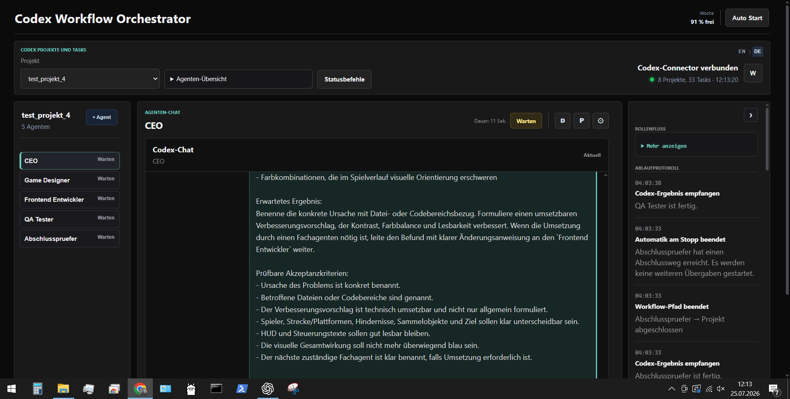
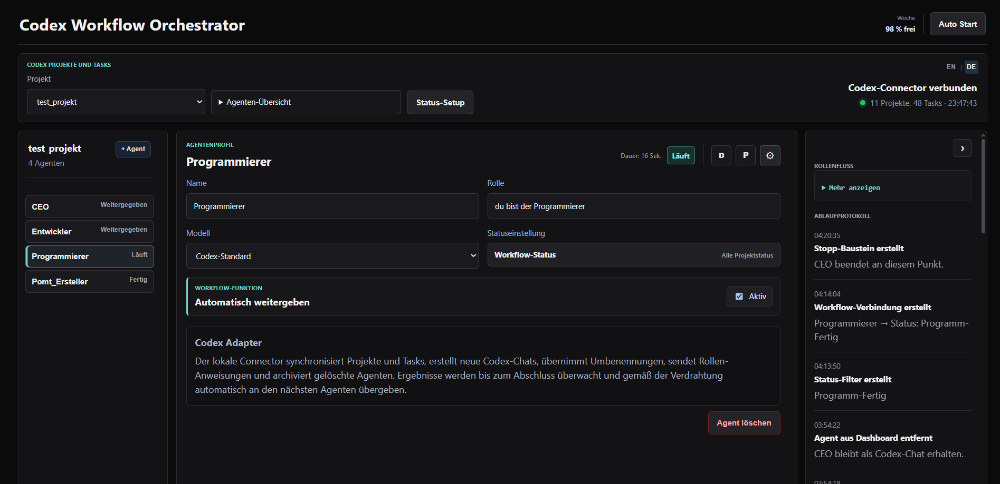
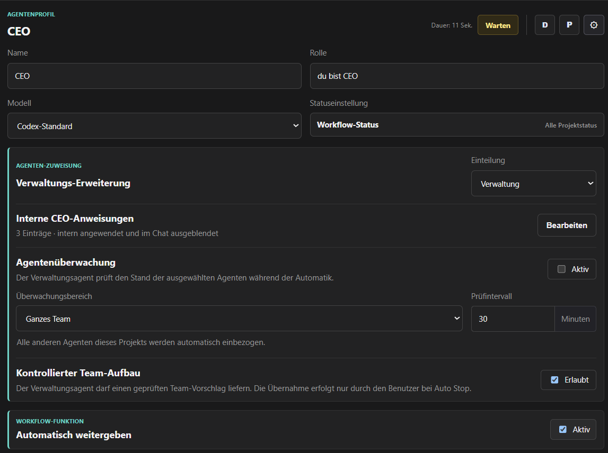
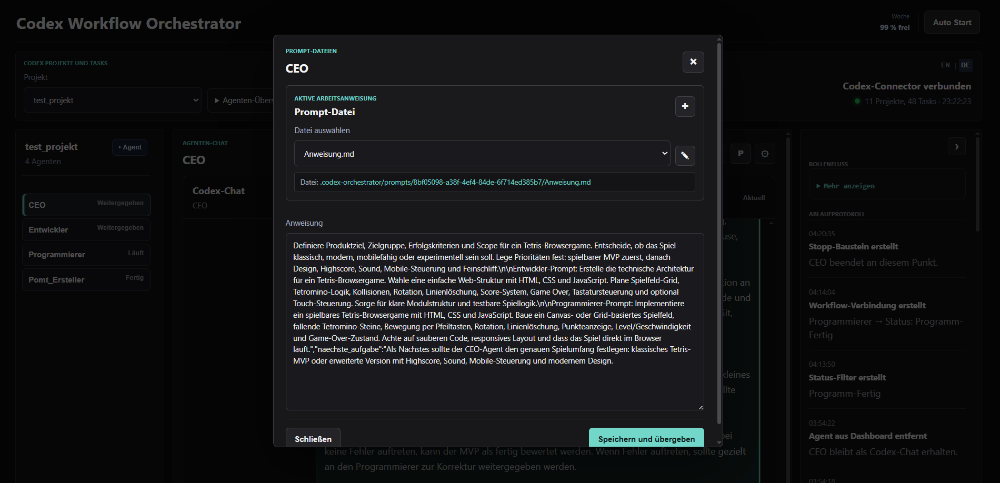
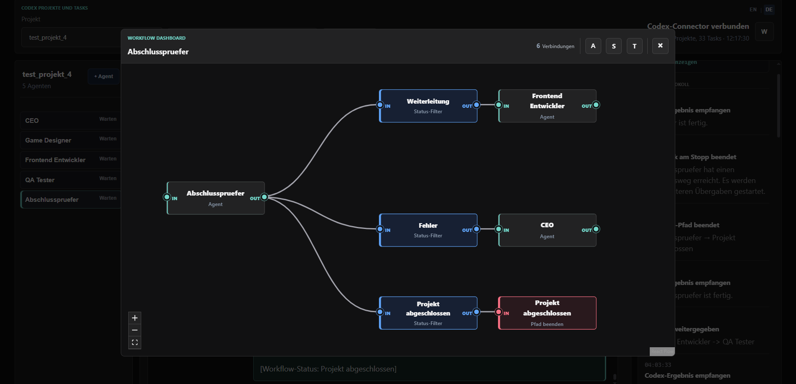
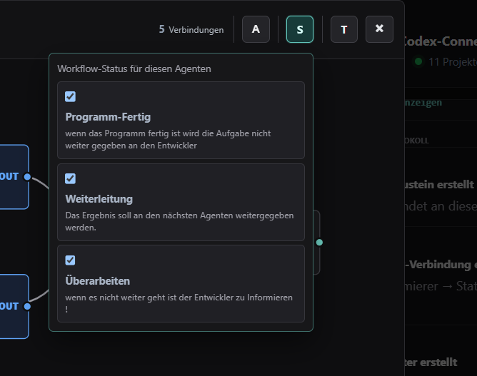
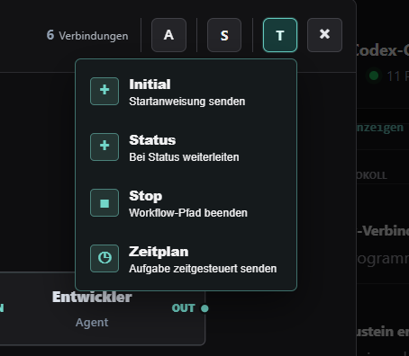
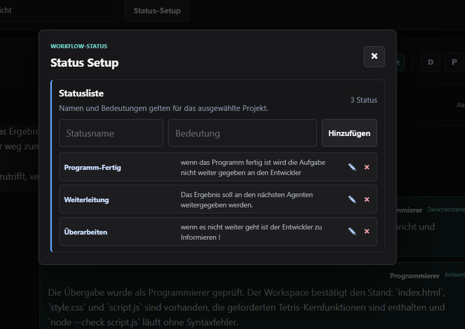

# Codex Workflow Orchestrator



Der Codex Workflow Orchestrator ist eine lokale Weboberfläche, mit der Codex-Chats als spezialisierte Agenten organisiert, verbunden und automatisiert ausgeführt werden können. Projekte, Chats, Rollen, Arbeitsanweisungen, Statusregeln und Workflow-Verbindungen werden an einer Stelle verwaltet.

## Funktionsumfang

- die in Codex gespeicherten Projekte und ihre zugehörigen Chats über den lokalen Connector einlesen
- nachträglich in Codex einem Projekt zugewiesene Chats automatisch dem richtigen Projekt zuordnen
- Chats als Agenten übernehmen, erstellen, umbenennen, ausblenden und archivieren
- Rollen, Modelle und erlaubte Statusbefehle pro Agent konfigurieren
- Agenten als Fach- oder Verwaltungsagenten einteilen
- ausgewählte Agenten während der Automatik intervallgesteuert überwachen
- kontrollierte Team-Vorschläge eines Verwaltungsagenten prüfen und übernehmen
- mehrere Prompt-Dateien pro Agent verwalten
- projektweite Wissensquellen als Ordner, Repository, Datei oder Weblink verwalten
- ein übergeordnetes Projektziel als gemeinsame, nicht ausführbare Orientierung verwalten
- direkte Nachrichten an einzelne Codex-Chats senden
- individuelle Workflows visuell aus Agenten und Werkzeugen aufbauen
- Ergebnisse anhand frei definierbarer Statusbefehle weiterleiten
- zeitgesteuerte Aufgaben einmalig oder wiederkehrend auslösen
- Laufstatus, Dauer, Chatverlauf und Ereignisprotokoll verfolgen
- die Bedienoberfläche zwischen Deutsch und Englisch umschalten
- globale Programmeinstellungen über den Profilbereich öffnen
- Designmodus, Oberflächenfarben, Schriftarten und Kontrast anpassen

## Oberfläche

### Profil und Programmeinstellungen

Am unteren Ende der Agentenleiste befindet sich der globale Profilzugang. Wenn der lokale Codex-Connector einen Kontohinweis bereitstellt, verwendet die Oberfläche dessen vorgeschlagenen Anzeigenamen; andernfalls wird neutral `Codex` angezeigt. Der Anzeigename kann ausschließlich lokal überschrieben werden. Die vollständige E-Mail-Adresse oder andere Kontodaten werden nicht an die Weboberfläche übertragen.

Ein Klick auf das Profil öffnet eine eigenständige Einstellungsansicht mit einem direkten Rücksprung über `Zurück zur App`. Diese Einstellungen gelten für die gesamte Anwendung und sind von den Setups einzelner Agenten getrennt.

Die kompakte Einstellungsansicht trennt Navigation und Inhalt klar voneinander und verwendet in allen Bereichen einheitliche Abstände, Feldhöhen und Bediengrößen.

Unter `Aussehen` stehen zur Verfügung:

- Design nach Systemeinstellung sowie ein heller und ein dunkler Modus
- kontrastoptimierte Oberflächen für Chat, Agentenliste, Protokoll und Workflow-Dashboard in beiden Modi
- durchgängige semantische Flächenfarben für Statusmenüs, Setup-Bereiche, Workflow-Werkzeuge, Fortschrittsanzeigen und Fehlermeldungen sowie klar erkennbare Gefahrenaktionen
- frei wählbare Akzent-, Hintergrund- und Vordergrundfarben
- Auswahl der UI- und Code-Schriftart
- regelbarer Oberflächenkontrast
- Rücksetzen auf das Standarddesign

Die gewählten Programmeinstellungen werden lokal im Browser gespeichert.

### Agenten-Chat

Die Hauptansicht kombiniert Projektauswahl, Agentenliste, laufenden Codex-Chat und Ablaufprotokoll. Eingaben können direkt an den ausgewählten Agenten gesendet werden. Im Chat scrollt ausschließlich der Nachrichtenverlauf; die Eingabezeile bleibt als feste Bedienleiste erreichbar. Auch der globale Profilzugang bleibt am unteren Rand der Agentenleiste fixiert. Aktivität, Laufzeit und letzter Zustand bleiben dabei sichtbar. Bei neuen Projekten ohne Agenten bleibt die Aufteilung mit einem neutralen leeren Chat-Bereich stabil.

Nach einem Connector-Neustart werden unterbrochene Team-Erstellungen anhand eines dauerhaften Transaktionsjournals bereinigt. Bereits vollständig gespeicherte Teams bleiben erhalten. Die Connector-Anzeige meldet relevante Bereinigungen oder Fehler kompakt, damit ein technischer Neustart nicht unbemerkt lokale Codex-Chats zurücklässt.

### Agenten-Setup

Neue und aus Codex übernommene Agenten erhalten automatisch die Rolle `du bist <Name>`. Solange diese Vorgabe nicht individuell bearbeitet wurde, folgt sie einer Umbenennung des Agenten.

Im Setup werden Name, Rolle, Modell und die für den Agenten erlaubten Statusbefehle festgelegt. Die automatische Weitergabe kann pro Agent aktiviert oder deaktiviert werden. Über die Agenten-Zuweisung wird zusätzlich festgelegt, ob ein Agent normale Fachaufgaben übernimmt oder eine Verwaltungs-Erweiterung erhält.



### Verwaltungs-Erweiterung

Ein Verwaltungsagent kann andere Agenten desselben Projekts überwachen. Im Setup wird festgelegt, ob das ganze Team oder nur ausgewählte Agenten geprüft werden; zusätzlich lässt sich das Prüfintervall in Minuten einstellen. Bei der Team-Auswahl werden später hinzukommende Agenten automatisch einbezogen. Solange die Automatik läuft, erhält der Verwaltungsagent regelmäßig eine kompakte Übersicht aus Laufstatus, Anzahl abgeschlossener Läufe und letztem Ergebnis. Er bewertet daraus Blockaden, Widersprüche, Wiederholungen und sinnvolle nächste Schritte.



Die Überwachung startet keine eigenmächtigen Änderungen an Agenten, Prompt-Dateien oder Dashboard-Verbindungen. Der Verwaltungsagent liefert eine fachliche Bewertung und konkrete Empfehlungen; technische Änderungen bleiben beim Orchestrator und benötigen eine Benutzerfreigabe.

#### Kontrollierter Team-Aufbau

Ist der Team-Aufbau im Verwaltungs-Setup erlaubt, kann der Benutzer den Verwaltungsagenten im Chat ausdrücklich mit der vollständigen Vorbereitung oder Umstrukturierung eines Teams beauftragen. Normale Produktänderungen, Reparaturen und Weiterentwicklungen autorisieren keinen Team-Vorschlag und verwenden das bestehende Team. Selbst wenn eine CEO-Antwort dabei irrtümlich Teamdaten enthält, bietet die Oberfläche diese ohne vorherige ausdrückliche Team-Anforderung nicht zur Übernahme an. Bei einem berechtigten Team-Aufbau erhält der Agent die vorhandene projektweite Statusliste, verwendet passende Statusbefehle unverändert wieder und ergänzt nur tatsächlich fehlende Befehle. Er plant Namen, Rollen, vollständige Arbeitsanweisungen, Statuszuweisungen, den benötigten Zugriff auf das Projektwissen, alle Verbindungen und mindestens einen eindeutigen Abschlussweg. Für jeden vorgeschlagenen Agenten ist eine ausdrückliche Entscheidung zum Projektwissen verpflichtend und wird im sichtbaren Team-Vorschlag ausgewiesen. Die Oberfläche zeigt diesen validierbaren Team-Vorschlag direkt im Agenten-Chat zur Prüfung und kontrollierten Übernahme an.

Es gibt keine feste Teamgröße von fünf Agenten. Ein maschinenlesbarer Teamvorschlag darf zwischen einem und zwölf Fachagenten enthalten; der bereits vorhandene CEO wird dabei nicht mitgezählt. Damit sind insgesamt bis zu zwölf vorgeschlagene Spezialisten plus CEO möglich. Die Zahl fünf im Beispielprojekt entsteht ausschließlich aus dem dort gewählten CEO und vier Fachrollen. Projektweite Statusbefehle sind unabhängig davon auf maximal zwanzig Einträge pro Teamvorschlag begrenzt.

#### CEO-Regelbuch

Der CEO ist ausschließlich Teamleiter. Er verwaltet, organisiert, vergibt Aufgaben, überwacht Ergebnisse und trifft Entscheidungen. Er programmiert nicht, verändert keine fachlichen Projektdateien, führt keine Implementierungsarbeit aus und übernimmt keine Spezialistenrolle. Diese Grenze wird bei direkten CEO-Nachrichten, Initial-Starts, Rückgaben aus dem Workflow und Überwachungsaufgaben erneut als vorrangige Laufzeitregel übermittelt. Die CEO-Optionen zeigen eine kompakte Zusammenfassung der internen Anweisungsliste. Über ein eigenes Popup lassen sich einzelne organisatorische Anweisungen dauerhaft hinzufügen, bearbeiten und löschen. Neue Verwaltungsagenten beginnen mit den empfohlenen Team- und Weiterleitungsregeln; anschließend ist die Liste vollständig benutzerverwaltet und darf auch leer sein.

Bei ausgeschalteter Automatik bereitet der CEO aus einer normalen Änderungsanweisung ein eindeutiges Delegationspaket für das vorhandene Team vor. Seine Rückmeldung nennt, dass der Auftrag vorbereitet ist und der Benutzer `Auto Start` drücken kann. Erst mit aktiver Automatik gibt der CEO dieses Paket über einen vorhandenen Statusweg an den passenden Fachagenten weiter. Ein Delegationspaket enthält Ziel, Ist-Stand, konkrete Änderung und prüfbare Akzeptanzkriterien. Neue Agenten oder Verbindungen darf der CEO weiterhin nur nach einem ausdrücklichen Teamumbau-Auftrag als freizugebenden Teamplan vorschlagen.

`Team übernehmen` führt ausschließlich bei `Auto Stop` folgende Schritte im aktuell ausgewählten Projekt aus:

- fehlende Codex-Chats mit einem neutralen Setup-Turn dauerhaft registrieren
- noch nicht vorhandene Statusbefehle projektweit anlegen
- Rollen und Statusbefehle zuweisen
- Arbeitsanweisungen als `Anweisung.md` speichern, ohne sie als Aufgabe zu starten
- einen neutralen Initial-Baustein ohne fachliche Aufgabe anlegen und ausschließlich mit dem CEO verbinden
- den CEO über einen normalen Statusfilter mit dem vorgesehenen ersten Fachagenten verbinden
- den Startpfad beim Verwaltungsagenten und die Folgepfade bei den jeweils sendenden Agenten anordnen
- jede geplante Übergabe über einen passenden Statusfilter mit dem nächsten Agenten verbinden
- jeden geplanten Gesamtabschluss über einen eigenen Statusfilter mit einem Stopp-Baustein verbinden
- den verpflichtenden Statusbefehl `Fehler` jedem Fachagenten zuweisen und als sichtbaren Rückweg zum Verwaltungsagenten verdrahten

Die Verdrahtung wird agentenbezogen gespeichert: Das Dashboard des Verwaltungsagenten enthält den kontrollierten Startpfad. Jeder weitere Agent sieht in seinem eigenen Dashboard seine ausgehenden Statusfilter und die damit verbundenen Zielagenten. Dadurch bleibt die Darstellung übersichtlich und die Übergaben werden nicht als doppelte Ausführungswege angelegt.

Der Verwaltungsagent besitzt damit eine systemgestützte Koordinationsfähigkeit: Er plant strukturierte Teamdaten, während der Orchestrator Agenten, Prompt-Dateien, Statusbefehle, Dashboard-Verbindungen und Abschlusswege validiert und erst nach Benutzerfreigabe anlegt. Ein Team-Vorschlag ohne Stopp-Pfad wird nicht übernommen. Ebenso wird eine Übernahme abgelehnt, wenn ein vorgeschlagener Statusname bereits mit einer anderen Bedeutung existiert. Ein nicht abgeschlossener oder nicht mehr auffindbarer Codex-Lauf wird als Status `Fehler` erfasst. Bei aktiver Automatik läuft dieses Ergebnis über den sichtbaren Fehlerpfad zurück zum Verwaltungsagenten, der die Ursache bewertet und den nächsten Schritt festlegt.

Scheitert derselbe Agent zweimal hintereinander, behandelt der Orchestrator dies als mögliche Überlastung oder als zu großen Arbeitsumfang. Der CEO erhält den letzten verfügbaren Arbeitsstand und den konkreten Fehlerkontext. Er muss die Restarbeit in begrenzte, prüfbare Pakete zerlegen und bei Bedarf einen zusätzlichen Spezialagenten samt Rolle, Prompt, benötigten Statusbefehlen und Dashboard-Verbindungen vorschlagen. Sobald dieser maschinenlesbare Team-Vorschlag vorliegt, wechselt die Automatik auf `Auto Stop`. Erst der Benutzer prüft und übernimmt den Vorschlag; neue Agenten werden weder heimlich angelegt noch automatisch gestartet.

Bei Zeitplänen, Agentenübergaben und Verwaltungsprüfungen wird die vollständige aktive Prompt-Datei des jeweiligen Zielagenten als verbindliche Arbeitsanweisung mitgesendet. Der Initial-Baustein ist davon getrennt: Er enthält ausschließlich Ablaufanweisungen und niemals eine fachliche Aufgabe, ein Projektziel oder Prompt-Inhalte. Sichtbar sendet er nur `Start` an den CEO. Die internen CEO-Anweisungen werden technisch angewendet, aber weder in der sichtbaren Startnachricht noch in der CEO-Antwort wiederholt. Der CEO liest die jüngste Benutzeranweisung in seinem Chat, prüft zuerst Eignung und Vollständigkeit des vorhandenen Teams und entscheidet anschließend mit einem normalen Statusbefehl über die Weitergabe an einen bestehenden Fachagenten. Ein Teamaufbau ist nur zulässig, wenn noch kein Team vorhanden ist oder für eine bestimmte Aufgabe tatsächlich ein geeigneter Fachagent fehlt.

Mehrere gleichzeitige Übergaben an denselben Zielagenten werden in einer zielbezogenen Warteschlange serialisiert. Ein CEO, Integrator oder anderer Sammelpunkt erhält dadurch erst die nächste Nachricht, wenn sein aktueller Codex-Turn abgeschlossen ist; parallele Rückmeldungen können den laufenden Turn nicht überschreiben.

Die Warteschlange gehört zum gemeinsam gespeicherten Orchestrator-Zustand. Ein Browser-Neuladen oder Prozessneustart verliert deshalb keine bereits wartende Parallelübergabe. Nach Abschluss des noch laufenden Ziel-Turns wird die gespeicherte Reihenfolge fortgesetzt.

Der Vorschlagsbereich unterscheidet sichtbar zwischen Warten auf Freigabe, laufender Verarbeitung und einer angehaltenen Übernahme. Während der Verarbeitung zeigt er den aktuellen Arbeitsschritt und einen rotierenden Fortschrittsindikator. Der Vorschlag verschwindet erst, wenn Agenten, Statusbefehle, Statuszuweisungen, Initial-Baustein, Statusfilter, Dashboard-Verbindungen und Stopp-Pfade vollständig vorhanden sind. Der Abschluss wird aus diesen tatsächlich gespeicherten Daten geprüft und nicht nur aus einer flüchtigen Erfolgsmeldung abgeleitet. Danach bestätigt ein Dialog, dass das Projekt startbereit ist. Eine zuvor unterbrochene Übernahme kann ohne doppelte Agenten über `Einrichtung vervollständigen` repariert werden.

Die vollständige Team-Konfiguration wird nach erfolgreicher Einrichtung als ein gemeinsamer Zustand gespeichert. Dabei verwendet der Connector eine Versionsprüfung: Ein älterer Browser-Tab kann eine zwischenzeitlich geänderte Agenten-, Status- oder Dashboard-Konfiguration nicht mehr mit seinem veralteten Stand überschreiben. Bei einem Konflikt lädt die Oberfläche stattdessen den neueren Connector-Zustand.

Der neutrale Setup-Turn bestätigt ausschließlich die dauerhafte Registrierung eines neuen Codex-Chats und löst keine Workflow-Weitergabe aus. Der Orchestrator startet danach weder die Automatik noch eine fachliche Aufgabe. `Auto Start` bleibt eine bewusste Benutzeraktion. Ein neues Projektverzeichnis wird nicht automatisch erzeugt, weil dessen Speicherort vom Benutzer beziehungsweise von Codex festgelegt werden muss.

Projektagenten starten mit einem expliziten, auf `workspace` innerhalb ihres Projektordners begrenzten Schreibbereich. Der Orchestrator legt diesen Unterordner automatisch an. Fachliche Dateien und Anwendungscode entstehen dadurch getrennt von `.codex-orchestrator`, Git-Metadaten und der übrigen Agentenkonfiguration. Diese Ausführungsregel wird bei jeder Chat-Nachricht, Prompt-Übergabe und automatischen Workflow-Aufgabe erneut gesetzt, sodass auch bereits vorhandene Codex-Chats korrekt im gemeinsamen Arbeitsordner arbeiten.

Während ein Agent erstellt wird, bleibt der Dialog geöffnet und zeigt einen deutlich sichtbaren, rotierenden Einrichtungsstatus. Eingabe und Schaltflächen sind bis zur Bestätigung des neuen Codex-Chats gesperrt, damit keine doppelten Erstellungsaufträge entstehen.

Beim Löschen bestätigt der Benutzer den Vorgang in einem anwendungseigenen Dialog. Ein verknüpfter Codex-Chat wird anschließend archiviert und aus der aktiven Projektansicht entfernt.

### Prompt-Dateien

Jeder Agent kann mehrere Arbeitsanweisungen als Markdown-Dateien besitzen. Dateien lassen sich erstellen, auswählen, umbenennen und bearbeiten. `Speichern und übergeben` schreibt die Datei atomar, liest sie serverseitig zurück und prüft den Inhalt per SHA-256. Erst danach werden der vollständige Prompt, der Dateipfad und der Prüfwert an den zugeordneten Codex-Chat gesendet. Der eingebettete Prompt ist die Ausführungsgrundlage; die Datei bleibt die persistente Prüffassung. Ein fehlgeschlagener Dateizugriff im Agenten blockiert deshalb nicht mehr die fachliche Bearbeitung.



Die Dateien liegen projektbezogen unter:

```text
.codex-orchestrator/prompts/<agent-id>/<dateiname>.md
```

Unveränderte Inhalte werden nicht erneut versendet.

### Workflow-Dashboard

Jeder Agent besitzt eine eigene gespeicherte Verdrahtung. Verbindungen verlaufen immer vom Ausgang `Out` zum Eingang `In`. Die Agentenauswahl `+` zeigt alle Agenten des aktuellen Projekts und fügt sie direkt in das geöffnete Dashboard ein. Bereits enthaltene Agenten lassen sich dort wieder entfernen; der Eigentümer des Dashboards bleibt fest sichtbar. Drag-and-drop aus der Seitenleiste steht zusätzlich zur Verfügung. Bausteine lassen sich frei und ohne Raster positionieren; nur die Aktion `A` ordnet sie automatisch an.



Die kompakten Aktionen im Dashboard sind:

- `+`: Projektagenten im Dashboard ein- oder ausblenden
- `A`: Bausteine automatisch anordnen
- `S`: Statusbefehle des Agenten bearbeiten
- `T`: Werkzeugpalette öffnen

### Statusauswahl

Über `S` werden die Statusbefehle festgelegt, die der jeweilige Agent verwenden darf. Name und Bedeutung stammen aus den projektweiten Statusbefehlen.



### Workflow-Werkzeuge



| Werkzeug | Aufgabe |
| --- | --- |
| Initial | Sendet sichtbar nur `Start` und intern ausschließlich Ablaufanweisungen an den CEO. |
| Status | Lässt nur Ergebnisse mit dem ausgewählten Statusbefehl passieren. |
| Stop | Beendet den Workflow-Pfad an dieser Stelle. |
| Zeitplan | Sendet eine Aufgabe einmalig, in einem Intervall oder zu einer festen Uhrzeit. |

Enthält der Initial-Baustein eine optionale Benutzeranweisung, zeigt er im Dashboard oben links einen kleinen Sprechblasen-Indikator. Ohne gespeicherten Benutzertext bleibt der Knoten unverändert.

Bausteine werden per Doppelklick konfiguriert. Ein einfacher Klick wählt einen Baustein oder eine Verbindung aus. Konfigurationsdialoge enthalten auch die jeweilige Löschfunktion.

## Projektziel

`Projektziel` neben `Statusbefehle` und `Datenbank` verwaltet genau ein übergeordnetes Ziel für das ausgewählte Projekt. Ausschließlich der Benutzer kann es über diesen Dialog erstellen, bearbeiten oder entfernen. Eingefügter Text wird einschließlich Leerzeichen und Zeilenumbrüchen unverändert gespeichert. Agenten, CEO, Teampläne, Stopp-Bausteine und automatische Abläufe besitzen keinen Schreibpfad für das Projektziel. Es wird projektlokal unter `.codex-orchestrator/project-goal.json` gespeichert und nicht mit Zielen anderer Projekte vermischt.

Das Projektziel wird allen Agenten bei direkten Nachrichten, Prompt-Übergaben, Initial-Starts, Workflow-Übergaben, Zeitplänen und Verwaltungsprüfungen als interne Orientierung und Qualitätskontrolle mitgegeben. Es ist ausdrücklich keine eigenständig auszuführende Aufgabe, kein Initialauftrag und kein Ersatz für Rollen-Prompts oder konkrete Übergaben. Ein Agent bearbeitet weiterhin ausschließlich seinen aktuellen Auftrag und meldet erkennbare Abweichungen vom Projektziel in seinem Ergebnis.

Beim kontrollierten Team-Aufbau ist das Feld `projectGoal` unzulässig. Ein entsprechender Agentenvorschlag wird abgelehnt und muss ohne Projektziel erneut ausgegeben werden. `Team übernehmen` verändert ausschließlich Agenten, Rollen, Statusbefehle und Workflow-Topologie; ein vorhandenes Projektziel bleibt unverändert.

## Statusbefehle

Jeder Agent erhält zusätzlich zu seinen auswählbaren fachlichen Statusbefehlen den nicht abwählbaren Systemstatus `Interner Workflow-Fehler`. Er wird ausschließlich verwendet, wenn keine zugewiesene Statusmeldung eindeutig zum Arbeitsergebnis passt oder mehrere Statusmeldungen gleichwertig passen. Der Agent muss die geprüften Statusmeldungen und die erkannte Lücke begründen. Dieser Zustand ist kein fachlicher Projektfehler.

Der Orchestrator übergibt den internen Workflow-Fehler eines Fachagenten unabhängig von normalen Projektverbindungen direkt an den Verwaltungsagenten beziehungsweise CEO desselben Projekts. Der CEO entscheidet anschließend, ob eine Statusbeschreibung, Statuszuweisung oder Dashboard-Verbindung korrigiert beziehungsweise ein neuer Status ergänzt werden muss. Der meldende Fachagent darf die Workflow-Konfiguration nicht selbst verändern. Meldet der CEO selbst diesen Systemstatus, blockiert der Ablauf kontrolliert für eine Benutzerentscheidung; eine Selbstweiterleitung wird nicht erzeugt. Formal ungültige Statussignale erhalten weiterhin genau einen Korrekturversuch; bleibt das Signal danach ungültig, wird es ebenfalls als interner Workflow-Fehler eskaliert.

Statusbefehle werden projektweit unter `Statusbefehle` angelegt. Jeder Eintrag besteht aus einem Namen und einer eindeutigen Bedeutung. Im Agenten-Setup und über `S` im Workflow-Dashboard wird ausdrücklich ausgewählt, welche Statusbefehle der Agent verwenden darf. Dadurch erhält der Agent ausschließlich diese erlaubten Statusbefehle samt Beschreibung als Arbeitskontext. Neu angelegte Agenten starten ohne Statusfreigabe; eine globale Statusdefinition bedeutet niemals automatisch eine globale Verwendung.

Der frühere Kompatibilitätswert `null = alle Projektstatus` wird nicht mehr verwendet. Beim Laden eines älteren Zustands leitet der Orchestrator die einmalige explizite Zuweisung ausschließlich aus vollständig verbundenen Pfaden `Agent → Statusfilter → Ziel/Stopp` ab. Nicht verbundene oder fremde Statusfilter werden nicht übernommen. Bei einem kontrollierten Team-Aufbau erhält der CEO ausschließlich den freigegebenen `startStatus`; fachliche Verteilungsstatus bleiben dem jeweils zuständigen Agenten zugewiesen.



Beispiel:

| Status | Bedeutung |
| --- | --- |
| `Weiterleitung` | Das Ergebnis soll an den nächsten Agenten übergeben werden. |
| `Überarbeiten` | Das Ergebnis muss erneut geprüft oder korrigiert werden. |

Der Agent gibt am Ende seiner Antwort einen passenden `workflow_status` aus. Ein Statusfilter vergleicht dieses Signal mit seiner Konfiguration und aktiviert nur den passenden Ausgangspfad. Der Orchestrator stellt dabei sicher, dass jeder in einer Verbindung oder einem Stopp verwendete Status dem sendenden Agenten zugewiesen ist.

```text
Agent -> Statusfilter "Weiterleitung" -> nächster Agent
      -> Statusfilter "Überarbeiten"  -> Prüfung oder Rückgabe
```

Statusbefehle beschreiben die Route des Ergebnisses. Der technische Abschluss eines einzelnen Codex-Laufs wird davon getrennt behandelt.

## Wissensdatenbank

Neben `Statusbefehle` öffnet `Datenbank` die Wissensquellen des aktuell ausgewählten Projekts. Ein Eintrag besteht aus Name, Quellentyp, lokalem Pfad beziehungsweise URL und einer optionalen Beschreibung. Das Quellentyp-Menü dient gleichzeitig als Kategorienfilter: Die Liste zeigt ausschließlich Repository-, Ordner-, Datei- oder Weblink-Einträge des ausgewählten Typs. Quellen lassen sich einzeln aktivieren, deaktivieren und löschen.

Die Datenbank wird projektlokal unter `.codex-orchestrator/knowledge-sources.json` gespeichert. Andere Projekte besitzen davon unabhängige Einträge. Aktive Quellen werden bei direkten Nachrichten, Prompt-Übergaben, Initial-Starts, Workflow-Übergaben, Zeitplänen und Verwaltungsprüfungen automatisch als interner Orientierungskatalog bereitgestellt. Die Quellen sind technisch schreibgeschützt; fachliche Ergebnisse und Änderungen bleiben auf den `workspace` des Projekts begrenzt. Lokale Quellen müssen absolute Pfade außerhalb des `workspace` verwenden. Pfade im `workspace` sowie Elternpfade, die den `workspace` einschließen, werden abgelehnt, damit keine Wissensquelle ganz oder teilweise beschreibbar ist.

Im Setup jedes Agenten steuert `Projektwissen verwenden`, ob dieser Agent den aktivierten Quellenkatalog erhält. Für bestehende und manuell angelegte Agenten ist der Schalter standardmäßig aktiv. Beim kontrollierten Team-Aufbau muss der CEO dagegen für jeden Agenten ausdrücklich entscheiden, ob dessen Rolle Projektwissen benötigt; diese Entscheidung wird bei der Übernahme auch auf bereits vorhandene Agenten angewendet. Ist der Schalter ausgeschaltet, werden dem Agenten bei keiner direkten Nachricht und keiner automatischen Workflow-Übergabe Wissensquellen mitgegeben. Eine separate Datenbankauswahl ist nicht erforderlich, weil immer die Datenbank des zugehörigen Projekts gilt.

Ein fachlicher Abschlussstatus kann zu einem Stopp-Baustein führen. Sobald dieser Pfad erreicht wird, beendet der Orchestrator die Automatik und startet keine weiteren Übergaben. Ein normaler Weiterleitungsstatus gilt dagegen ausdrücklich nicht als Projektabschluss.

Enthält eine Agentenantwort trotz vorhandener Route keinen gültigen Status, mehrere Statusangaben, einen unbekannten Namen oder Text nach der Statuszeile, fordert der Orchestrator einmalig im selben Agenten-Chat eine reine Protokollkorrektur an. Der Agent darf dabei weder die Facharbeit wiederholen noch seine bereits getroffene Entscheidung ändern. Er wählt ausschließlich einen exakten Namen aus seiner zugewiesenen Statusliste. Ist auch der Korrekturversuch ungültig oder fehlt die technische Route, pausiert der Lauf kontrolliert und speichert einen blockierten Kontrollpunkt; eine Route wird niemals aus freiem Antworttext geraten.

Der Status `Fehler` ist für kontrolliert aufgebaute Teams reserviert. Er signalisiert keinen fachlichen Projektstatus, sondern einen technisch unterbrochenen Codex-Lauf. Der zugehörige Statusfilter führt zurück zum Verwaltungsagenten, statt den betroffenen Agenten dauerhaft als aktiv erscheinen zu lassen. Meldet der Verwaltungsagent selbst `Fehler` oder scheitert sein Lauf technisch, stoppt die Automatik kontrolliert und wartet sichtbar auf eine Benutzerentscheidung. Eine Selbstverknüpfung des Verwaltungsagenten wird dabei nicht erzeugt. Bereits gespeicherte Selbstverknüpfungen aus älteren Zuständen werden beim Laden entfernt; eine dabei noch aktive Automatik wird sicherheitshalber gestoppt.

## Automatik

`Auto Start` aktiviert die Ausführung des verbundenen Workflows. Vor einem neuen Initial prüft der Orchestrator, ob für das ausgewählte Projekt ein offener Kontrollpunkt existiert. Ist eine gültige Übergabe vorgemerkt, setzt er den vorhandenen Lauf mit dem gespeicherten Quellresultat, Status und Zielagenten fort. Nur ohne offenen Kontrollpunkt beginnt ein neuer Lauf; dabei werden die Duplikat-Sperren des vorherigen Laufs zurückgesetzt. Ein blockierter Kontrollpunkt startet nicht unbemerkt neu, sondern bleibt sichtbar und verlangt zuerst eine korrigierte Agentenantwort oder Workflow-Konfiguration.

Jeder Lauf wird projektbezogen mit Lauf-ID und geordneten Schritten gespeichert. Das Journal hält Agentenergebnisse, Statusentscheidungen, vorbereitete und ausgeführte Übergaben, Pausen, Wiederaufnahmen und Abschlüsse fest. Der aktuelle Kontrollpunkt erscheint im rechten Bereich `Arbeitslauf`. Auch eine bei `Auto Stop` fertiggestellte direkte Agentenantwort wird als Fortsetzung vorgemerkt, wenn sie exakt einen erlaubten Status und einen vorhandenen Zielpfad enthält.

Pro Projekt darf höchstens ein neutraler Initial-Baustein existieren. Er sendet sein Startsignal ausschließlich an den CEO. Der Benutzer kann darin optional eine zusätzliche reine Ablaufanweisung speichern; fachliche Aufgaben, Projektziele und Prompt-Angaben sind dort nicht zulässig. Nur ausdrücklich als Benutzertext markierte Inhalte werden intern beim Auto-Start ergänzt. Teamaufbau, CEO und Orchestrator dürfen dieses Feld nicht automatisch befüllen. Rollen-Prompts, automatisch erzeugte Aufgaben und alte unmarkierte Inhalte werden daraus nicht ausgeführt. Ein Teamplan überschreibt eine vorhandene Benutzeranweisung nicht und speichert seine `startInstruction` niemals im Initial. Ohne Benutzertext liest der CEO ausschließlich die aktuelle Benutzeranweisung aus seinem Chat und leitet sie über einen normalen Statusbefehl weiter. Der Connector überwacht laufende Agenten und passende Ergebnisse werden entlang der Verdrahtung weitergegeben.

Eine Übergabe gilt erst als erfolgreich, wenn der Connector für den Ziel-Chat eine konkrete Turn-ID bestätigt hat. Erst danach wird der Zielagent als aktiv und der Quellagent als `Weitergegeben` markiert. Fehlende Chat-Verknüpfungen, Connector-Fehler oder Antworten ohne Turn-ID führen sichtbar zu `Rückfrage`. Bei mehreren Zielen werden nur die tatsächlich angenommenen Übergaben als erfolgreich protokolliert.

`Auto Stop` blockiert neue automatische Aktionen:

- keine neuen Initial-Anfragen
- keine neue Kommunikation zwischen Agenten
- keine Ausführung fälliger Zeitpläne
- keine neue automatische Weitergabe
- ruhende Verbindungsanimationen
- keine manuelle oder verwaltete Erstellung neuer Agenten
- keine weiterlaufende, automatisch gestartete Wartungsdiagnose

Ein Agent, der beim Stoppen bereits arbeitet, darf seinen laufenden Codex-Turn noch abschließen. Danach wird keine weitere Route gestartet und sein Laufstatus auf `Warten` zurückgesetzt. Auch alle bereits abgeschlossenen Agentenstatus werden bei `Auto Stop` auf `Warten` gesetzt; nur wirklich laufende Turns bleiben bis zu ihrem Abschluss aktiv sichtbar. Direkte Chat-Nachrichten und manuelle Prompt-Übergaben bleiben auch bei ausgeschalteter Automatik verfügbar. Ihr tatsächlicher Laufstatus wird unabhängig von `Auto Start` in der Agentenliste, im Chatkopf und am Codex-Chat als sichtbare Arbeitsanimation angezeigt.

Der Connector gleicht laufende Turn-IDs zusätzlich mit dem aktuellen Codex-Taskstatus ab. Fehlt der angeforderte Turn in der Historie und ist der Codex-Task bereits inaktiv, bestätigt eine kurze Nachlaufzeit zuerst, dass es sich nicht nur um eine verzögerte Aktualisierung der lokalen Historie handelt. Erst danach wird der Agent auf `Rückfrage` gesetzt. Dadurch werden parallele, bereits abgeschlossene Turns nicht fälschlich abgebrochen und tatsächlich verwaiste Turns bleiben trotzdem nicht dauerhaft aktiv.

Nach `turn/start` gleicht der Connector die zunächst gemeldete Turn-ID mit der tatsächlich gespeicherten Codex-Historie ab. Falls Codex intern eine abweichende endgültige ID vergibt, überwacht der Orchestrator automatisch diese persistierte ID. Dadurch werden fertiggestellte Antworten nicht mehr fälschlich als fehlender oder unterbrochener Turn behandelt.

Bleibt eine zunächst gemeldete Turn-ID trotz einer bereits abgeschlossenen Codex-Antwort aktiv, ordnet die Oberfläche die Antwort zusätzlich über den exakt gesendeten Auftrag zu und übernimmt die tatsächlich gespeicherte Turn-ID. Bei mehreren geöffneten Browser-Tabs hält außerdem nur ein Tab eine kurzlebige Automatik-Sperre. Damit werden Übergaben, Überwachungen und Zeitpläne nicht doppelt ausgeführt; beim Schließen des führenden Tabs kann ein anderer Tab den Lauf automatisch übernehmen.

### Systemüberwachung

Eine deterministische Systemüberwachung beobachtet den tatsächlich gespeicherten Codex-Turn. Bleibt dessen sichtbarer Fortschritt drei Minuten unverändert oder überschreitet ein Lauf 45 Minuten, unterbricht der Connector genau diesen Turn kontrolliert. Der Agent erhält den Status `Fehler`; ein vorhandener Fehlerpfad führt die Diagnose an den Verwaltungsagenten beziehungsweise CEO zurück. Technische Fehler werden pro Codex-Turn erneut gemeldet. Die normale Duplikat-Sperre verhindert weiterhin identische fachliche Endlosschleifen, blockiert aber keine neue Abbruchmeldung.

Der Orchestrator merkt sich bei einer Übergabe zusätzlich den unmittelbar sendenden Agenten. Meldet ein Verwaltungsagent nach einer Fehleranalyse eine konkrete, begrenzte Wiederaufnahme- oder Überarbeitungsaufgabe und existiert dafür kein eigener Dashboard-Pfad, wird diese Antwort gezielt an den betroffenen Agenten zurückgegeben. Ein vollständiger Team-Vorschlag bleibt dagegen bei `Auto Stop` und wartet auf die Freigabe des Benutzers. Meldet der Verwaltungsagent selbst einen technischen Fehler oder gibt es keinen gültigen Fortsetzungsweg, stoppt die Automatik sichtbar, anstatt ohne aktive Arbeit eingeschaltet zu bleiben. Der Watchdog greift pro Codex-Turn höchstens einmal ein.

Zusätzlich gehört der interne **Kommunikations-Worker** fest zum Orchestrator. Er ist kein Projektagent und erscheint deshalb weder in der Agentenliste noch in einem Projekt-Dashboard. Sein eigener Codex-Task arbeitet ausschließlich im Arbeitsordner des Orchestrators und ist auf folgende technische Diagnosebereiche beschränkt:

- Connector und Codex-App-Server-Protokoll
- Erstellung, Persistenz, Abfrage und Unterbrechung von Turns
- Agentenstatus, Zielwarteschlangen und automatische Übergaben
- Statusrouting, Automatik-Lease und festhängende Workflow-Verarbeitung

Bei einem Watchdog-Eingriff startet der Kommunikations-Worker automatisch eine **lesende Diagnose**. Eine Diagnose kann außerdem über die kompakte Schaltfläche `W` am Connector manuell angefordert werden. Der Bericht nennt Ursache, Indizien, betroffene Komponente und den kleinstmöglichen Reparaturvorschlag. Fachliche Inhalte und Dateien ausgewählter Benutzerprojekte gehören ausdrücklich nicht zu seinem Zuständigkeitsbereich.

Kommunikations-, Connector- und Routingfehler werden im Hintergrund an den Kommunikations-Worker gemeldet, ohne für jeden Fehler ein zusätzliches Dialogfenster zu öffnen. Nur wenn der Watchdog einen festhängenden Codex-Lauf tatsächlich abbricht, erscheint ein kompakter Hinweis mit Agent, Laufzeit und direktem Zugang zum Diagnosebericht.

Neben der Schaltfläche zeigt die Oberfläche den aktuellen Wartungszustand dauerhaft an: `Bereit`, `Diagnose`, `Bericht` oder `Fehler`. So bleibt auch bei geschlossenem Wartungsfenster sichtbar, ob der Kommunikations-Worker arbeitet oder ein Bericht vorliegt.

Der Worker ist strikt diagnose-only: Er darf keine Datei ändern, keine Workflow-Verbindung erzeugen oder bearbeiten, keine Reparatur ausführen und keinen Prozess neu starten. Bei einer automatischen, eindeutig einem Projektagenten zugeordneten Diagnose übergibt der Connector den fertigen Bericht an genau einen zuständigen und freien Verwaltungsagenten beziehungsweise CEO. Ist die Zuständigkeit nicht eindeutig oder der CEO beschäftigt, bleibt die Übergabe sichtbar ausstehend und wird beim nächsten Statusabruf erneut geprüft.

Der CEO bewertet Ursache und Reparaturvorschlag. Bei bereits konfigurierten Fehlerpfaden kann eine begrenzte Wiederaufnahmeanweisung über den vorhandenen Rückgabepfad an den betroffenen Agenten gehen. Fehlt ein gültiger Fortsetzungsweg, bleibt die Automatik gestoppt. Dauerhafte Änderungen an Agenten, Statusfiltern oder Verbindungen muss der CEO als vollständigen Teamplan vorschlagen; nur der Orchestrator darf diesen nach Benutzerfreigabe validieren und anwenden. Die Oberfläche erzeugt keine automatischen Reparaturrouten mehr. Der Wartungszustand wird im Connector gespeichert, sodass Diagnose und Übergabestatus auch nach einem Browser-Neuladen erhalten bleiben.

## Zeitpläne

Ein Zeitplan enthält eine Aufgabe und wird mit dem Zielagenten verbunden.

```text
Zeitplan -> Agent
```

Unterstützt werden:

- einmalige Ausführung
- wiederkehrende Intervalle in Minuten, Stunden, Tagen oder Wochen
- wiederkehrende Ausführung zu einer festen Uhrzeit
- einmalige Kalendertermine mit Datum und Uhrzeit

Zeitpläne werden nur ausgeführt, wenn der Baustein aktiviert ist und die Automatik läuft. Ist der Zielagent beschäftigt, wartet die Ausführung auf einen freien Zustand.

## Typischer Ablauf

1. Ein Codex-Projekt auswählen.
2. Vorhandene Chats in der Agenten-Übersicht aktivieren oder einen Agenten erstellen.
3. Rolle, Modell und erlaubte Statusbefehle im Agenten-Setup festlegen.
4. Über `P` eine oder mehrere Prompt-Dateien einrichten und übergeben.
5. Über `D` das Dashboard öffnen.
6. Agenten und Werkzeuge von `Out` nach `In` verbinden.
7. Bausteine konfigurieren und den Ablauf mit `Auto Start` auslösen.
8. Ergebnisse im Agenten-Chat und im einklappbaren Ereignisprotokoll verfolgen.

## Installation und Start

### Voraussetzungen

- Windows
- Node.js mit `npm`
- lokal angemeldete Codex-Installation
- Zugriff des Connectors auf den lokalen Codex-App-Server

Am einfachsten startet die Anwendung per Doppelklick auf:

```text
start.bat
```

Das Skript installiert fehlende Abhängigkeiten, startet den überwachten Connector auf Port `4317`, startet die Weboberfläche auf Port `5173` und öffnet anschließend:

```text
http://127.0.0.1:5173/
```

Alternativ:

```powershell
npm install
npm run bridge
npm run dev -- --host 127.0.0.1
```

`npm run bridge` startet einen lokalen Supervisor. Er prüft den Connector regelmäßig über `/api/health`, protokolliert Prozessfehler unter `server/logs/bridge-supervisor.log` und startet die Bridge nach einem Absturz oder mehreren fehlgeschlagenen Gesundheitsprüfungen automatisch neu. Für eine gezielte Diagnose ohne automatische Wiederherstellung steht `npm run bridge:direct` zur Verfügung.

## Architektur

```text
React/Vite-Weboberfläche
        |
        v
Lokaler Connector auf Port 4317
        |
        v
Codex-App-Server
        |
        v
Codex-Projekte und Codex-Chats
```

Wichtige Bereiche:

```text
src/App.tsx                   React-Anwendungszustand und UI-Komposition
src/workflow-canvas.tsx       React-Flow-Knoten, Kanten und Ziehvorschau
src/workflow-protocol.ts      Strikte Auswertung der Workflow-Statussignale
src/workflow-routing.ts       Technische Auflösung von Statusfiltern und Zielpfaden
src/workflow-decision.ts      Fortsetzen-, Beobachten- oder Stoppen-Entscheidung
src/workflow-runtime.ts       Persistentes Laufjournal und Wiederaufnahme-Kontrollpunkte
src/delivery-queue.ts         Persistierbare Warteschlange paralleler Übergaben
src/workflow-state.ts         Bereinigung verwaister Dashboard- und Positionsreferenzen
server/bridge.mjs             Lokaler Connector zum Codex-App-Server
server/prompt-files.mjs       Atomares Schreiben und SHA-256-Prüfung von Prompt-Dateien
server/bridge-supervisor.mjs  Health-Check, Fehlerprotokoll und automatischer Neustart
start.bat                     Windows-Startskript
```

Der Orchestrator-Zustand wird lokal gespeichert. Prompt-Dateien werden im jeweiligen Projekt unter `.codex-orchestrator/prompts/` verwaltet. Lokale Zustände, Zugangsdaten und Chatdaten werden nicht versioniert.

Gemeinsame Zustandsänderungen werden pro Browserfenster serialisiert. Veraltete, noch wartende Snapshots werden verworfen, damit beispielsweise ein bereits ausgelöster `Auto Stop` nicht durch eine verspätete ältere `Auto Start`-Speicherung zurückgesetzt wird.

### Entscheidungshierarchie

Die technische Workflow-Topologie ist die maßgebliche Entscheidungsebene. Ein Agententext darf keine Verbindung erzeugen, verändern oder umgehen. Er liefert ausschließlich genau ein Statussignal in der letzten Zeile. Das Protokoll akzeptiert nur einen exakten, für den Agenten erlaubten Statusnamen. Fehlende, unbekannte, mehrfach gesetzte oder nicht abschließend platzierte Statusangaben stoppen den betroffenen Fach- oder Initialpfad kontrolliert, statt aus dem Fließtext ein Ziel zu erraten. Nur ein vom Orchestrator ausdrücklich mit dem Laufzweck `monitoring` gestarteter CEO-Lauf darf als ereignislose Beobachtung ohne Status enden. Der persistierte Laufzweck verhindert, dass eine unvollständige Initial- oder Chatantwort fälschlich als Überwachung behandelt wird. Erst ein gültiges Signal darf einen vorhandenen Statusfilter aktivieren; der Statusfilter und seine gespeicherte Verbindung bestimmen anschließend das tatsächliche Ziel.

Sprachliche CEO-, Rollen- und Initialanweisungen erklären dieses Verhalten, besitzen aber keine eigene technische Routingmacht. So bleibt eindeutig: Code und gespeicherte Topologie entscheiden, Text liefert nur validierte Eingabedaten.

## Entwicklung und Prüfung

```powershell
npm run lint
npm run build
npm test
```

`npm test` startet zusätzlich einen isolierten Chromium-Smoke-Test der echten React-Oberfläche. Er verwendet einen kontrollierten Testzustand und prüft das Öffnen des CEO-Setups sowie Hinzufügen und Löschen interner CEO-Anweisungen, ohne reale Codex-Projekte oder Chats zu verändern. Ist lokal kein unterstützter Chromium-Browser vorhanden, wird ausschließlich dieser UI-Test übersprungen.

Die übrige Suite prüft die atomare Zustandsspeicherung, monotone Versionsstände und den
Schutz vor überschreibenden Änderungen aus veralteten Browser-Tabs. Die Tests
prüfen außerdem einen vollständigen Team-Aufbau mit Rollen-Prompts, Statusbefehlen,
Start-, Fehler-, Arbeits- und Abschlusswegen sowie individuellen Dashboard-Zuordnungen.
Eine vollständige Workflow-Simulation führt eine validierte CEO-Delegation über einen
Fachagenten bis zum Stopp. Weitere Szenarien prüfen fehlende, unbekannte, mehrfache und
falsch platzierte Statusangaben, unvollständige CEO-Antworten, parallele Übergaben und
die Wiederaufnahme ihrer gespeicherten Warteschlange nach einem simulierten Neustart.
Ein simulierter Connector-Abbruch prüft, dass bereits erstellte Codex-Chats wieder
archiviert werden und keine unvollständige Teamkonfiguration sichtbar wird.
Der Connector führt dafür ein lokales Transaktionsjournal. Nach einem Browser- oder
Connector-Neustart werden unterbrochene Team-Erstellungen automatisch bereinigt;
bereits atomar gespeicherte Teams werden anhand ihrer Team-Signatur beibehalten.
Sie verwenden ausschließlich temporäre Dateien und verändern keine Projekte oder Chats.

Die Produktionsausgabe wird unter `dist/` erzeugt.

Im Workflow-Dashboard verwenden alle Knoten eine stabile Geometrie mit vergrößerten Anschlussflächen. React Flow misst diese Anschlüsse nach jedem Dashboardaufbau neu, damit Verbindungen exakt mittig an den sichtbaren Ein- und Ausgängen andocken. Beim Ziehen folgen der neutrale weiße Griffpunkt und der Kopf der Vorschau-Linie über dasselbe native Zeigerereignis unmittelbar dem Mauszeiger. Der Linienanfang wird über die von React Flow gemeldete Knoten- und Handle-ID direkt am sichtbaren Mittelpunkt des tatsächlich gegriffenen DOM-Anschlusses verankert. Dadurch beeinflussen Zoom, Verschiebung und Modalposition den Ausgangspunkt nicht. Die Linienführung passt sich der Anordnung an: Vorwärts seitlich versetzte Kästen verbindet eine durchgehend fließende Bézier-Kurve, deutlich untereinander angeordnete Kästen behalten die gut lesbare gerundete Schrittführung. Liegt das Ziel hinter dem Ausgangsknoten, bleibt diese Umleitungsführung unabhängig von der Entfernung aktiv. Beim Wechsel werden beide Formen weich überblendet; gespeicherte Verbindung und Ziehvorschau verwenden dieselbe Berechnung. Doppelte Verbindungen werden nicht gespeichert und vorhandene doppelte Initial-Routen automatisch bereinigt. Die höhere Ziehschwelle reduziert unbeabsichtigte Sprünge beim Verschieben und Verbinden.

## Bekannte Grenzen

- Bereits geöffnete Codex-Ansichten können eine eigene Aktualisierung benötigen, obwohl der Connector eine Änderung bereits verarbeitet hat.
- Automatische Statusrouten benötigen genau einen erlaubten Workflow-Status als letzte Antwortzeile und eine dafür gespeicherte Verbindung.
- Rollen, Arbeitsanweisungen und Statusbedeutungen müssen für den jeweiligen Ablauf eindeutig formuliert sein.
